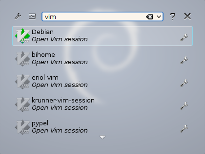
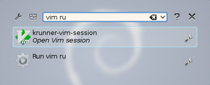
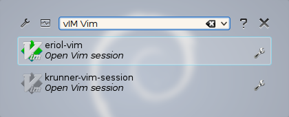
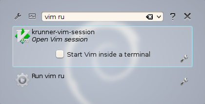

Getting started
===============

``krunner-vim-sessions`` uses ``vim`` keyword to search your Vim sessions.

Sessions must be inside::

    ~/.vim/sessions/

.. note::
    I suggest to use `vim-session <http://peterodding.com/code/vim/session/>`_
    by Peter Odding.

Using krunner-vim-sessions
--------------------------

Inserting only the keyword will show all the sessions.

To perform a search simply write something after the keyword: 
``krunner-vim-sessions`` will match all sessions that contain the provided
text.

The search is **case insensitive** (even the keyword) so searching for
``vim vim`` or ``vIM Vim`` is the same.

Runtime options
---------------

``krunner-vim-sessions`` uses GVim as default but selecting
``Start Vim inside a terminal`` it will use Vim inside the default terminal
application.

